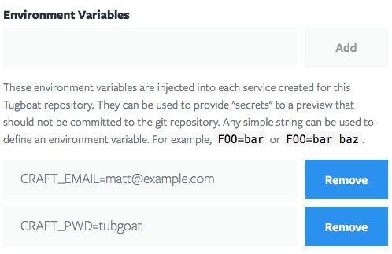

# Tugboat Template for Craft 3

This is a [configuration file](https://github.com/TugboatQA/craftcms/blob/master/.tugboat/config.yml) for spinning up a new Craft 3 site in Tugboat. It uses Composer to download the latest version of Craft 3 and spin up a clean LAMP stack. 

Tugboat is free to use. It comes in handy to automatically build out a fully working version of the site for every pull request, branch or tag. 

## Installation

1. Fork this repository and create a new project in [Tugboat](https://dashboard2.tugboat.qa/).
2. You'll need to create custom environment variables in Tugboat for the site email and user password. Once your forked repository is created, navigate to the Repository Settings page in Tugboat and add the following environment variables:

    

    - CRAFT_EMAIL="Your email address"
    - CRAFT_PWD="Choose a password for the initial user"

    Whenever Tugboat spins up a preview, these credentials will give you access to the Craft CMS backend. 
    
That's it. For more information check out the [Tugboat documentation](https://docs.tugboat.qa) to see what else you can do. If you have any questions, [hit us up in Slack](https://launchpass.com/tugboatqa). May the wind always be at your back. --Matt

